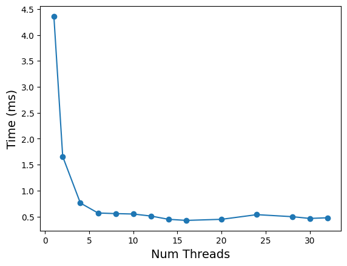
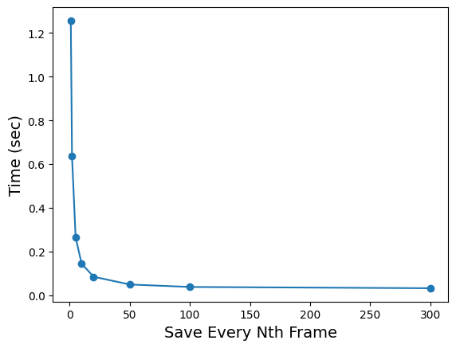
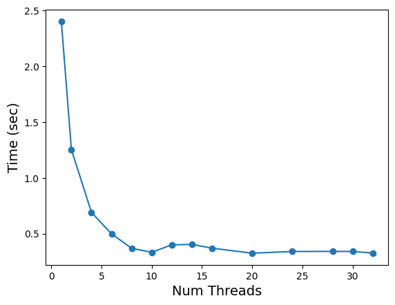
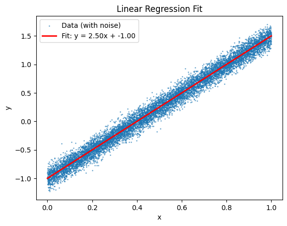
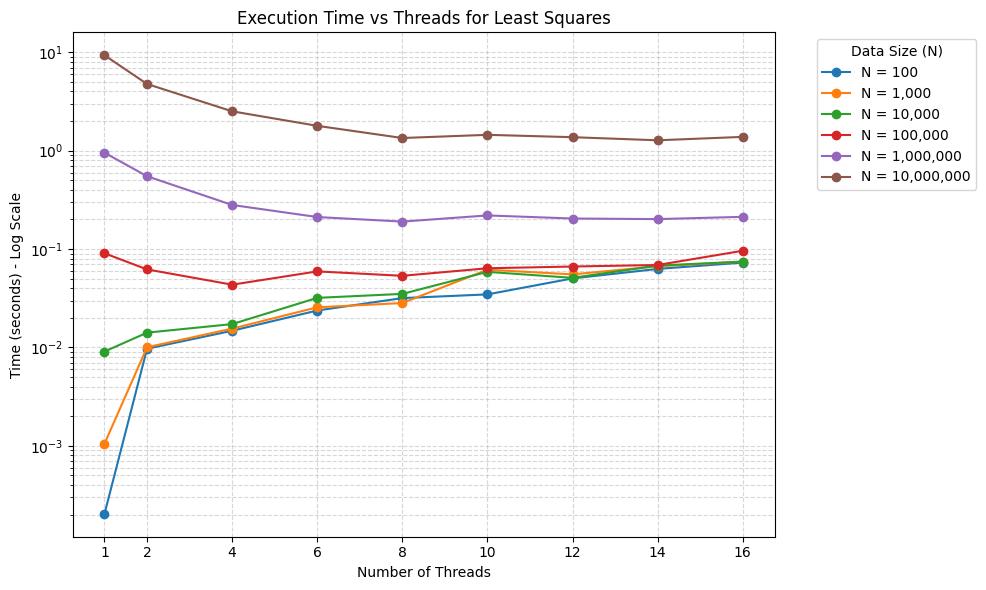

# HPC Course 2026, Homework 1.

Report on the work done is this README.

All compilations and executions can be done via the scripts in the [scripts](scripts) directory.

I did this task on MacBook Pro with chip M4 Pro with ~12 parallel threads possible.

All plots can be found in the [plots.ipynb](plots.ipynb) file.

---

## Programs with bugs

### `BugReduction.c`

Script for running is `scripts/bugs.sh`.

**Bug:** `main` had `#pragma omp parallel shared(sum)` around only the call `dotprod(a, b, N)`. So, each thread had `dotprod` with its own stack frame, so the local `sum` in `dotprod` is effectively private per thread.

**Fix:** Use a single `#pragma omp parallel for reduction(+ : sum)` inside `dotprod` function, so the parallel region and the loop with reduction are one construct and `sum` follows the normal reduction rules.

**Bug:** Result never stored in `main`. `dotprod` returns the dot product, but `main` never did `sum = dotprod(...)`.

**Fix:** add `sum = dotprod(a, b, N)` in the main.

**Bug:** `tid` printed wrong. `tid = omp_get_thread_num()` ran once before the parallel loop, so every iteration would have seen the same tid.

**Fix:** Use `omp_get_thread_num()` inside the loop.

### `BugParFor.c`

Script for running is `scripts/bugs.sh`.

**Bug:** `schedule(static, chunk)` was placed on `#pragma omp parallel` only. Putting it on `omp parallel` is invalid: the parallel region only forks threads; it does not distribute loop iterations.

**Fix:** Use `#pragma omp parallel for schedule(static, chunk)` so scheduling applies to the loop.

**Bug:** No parallel loop — every thread did all iterations. Inside `parallel` we had a plain `for (i = 0; i < N; ++i)` with no `omp for`. Every thread ran the full loop, so each `c[i]` was written many times and work was duplicated.

**Fix:** Make it a single `parallel for` so iterations are split across threads.

**Bug:** `private(i, tid)` and `tid` set before the loop. `tid` was set once per thread before the loop; with a correct parallel loop, `omp_get_thread_num()` should be used where we report work, so each printed line matches the thread that actually ran that iteration.

**Fix:** Drop the extra `private/shared`: the loop variable is handled correctly by `parallel for`; use `omp_get_thread_num()` in the `printf` for the real thread id per iteration.

## Sequential programs to parallelize

### `Pi.c`

Script for running is `scripts/pi.sh`.

I parallelized sum computation in the for loop with `#pragma omp parallel for reduction(+ : sum)`. I added Open MP's internal execution time measurement, `omp_get_wtime`, to see time gains from increase in number of threads.

In the figure below, you can see the time elapsed to compute pi with different numbers of threads used. We see that using more than 10 threads does not affect the speed.

### `Car.cpp`

Script for running is `scripts/car.sh`.

I parallelized the image shift operation in Car.cpp by adding #pragma omp parallel for to the loop over image rows (i).
For each animation step, each thread processes different rows independently: it shifts columns to the right (A[i][j] -> A[i][j+1]) using an auxiliary array with one extra column (M+1), and wraps the last column into the first position. Since threads work on separate row ranges, there are no write conflicts.

The time took to compute the animation with different save frequencies is shown in the figure below. We see that, more frequently we save, more time we spend on computing the animation. But the frequency of 50 is the best, because it is the balance between the time spent on computing the animation and the time spent on saving the frames.

## Problems with an asterisk to parallelize

In the archive provided there were no `Axisb.c` and `LeastSquares.c` implementations, so I did my implementations and parallelized them.

### `Axisb.c`

Script for running is `scripts/Axisb.sh`.

The Jacobi method is an iterative algorithm used to solve a system of linear equations $Ax = b$. It works by continuously refining an initial guess for the solution $x$. In each iteration, the new value for a specific variable $x_i$ is calculated using the other variables $x_j$ from the *previous* iteration:

$$x_i^{(k+1)} = \frac{1}{a_{ii}} \left( b_i - \sum_{j \neq i} a_{ij} x_j^{(k)} \right)$$

This method is guaranteed to converge if the matrix $A$ is strictly diagonally dominant (the absolute value of each diagonal element is greater than the sum of the absolute values of the other elements in that row).

**Test Matrix:**
For testing, I generated a dense $2000 \times 2000$ matrix with random floating-point values between $0.0$ and $1.0$. To ensure the Jacobi method converges, the matrix is explicitly made strictly diagonally dominant by setting each diagonal element to the sum of its row's elements plus $1.0$.

**Parallelization:**
The Jacobi method is highly parallelizable because the calculation of each $x_i^{(k+1)}$ depends only on the values from the previous iteration $x^{(k)}$. This means there are no data dependencies between the updates of different variables in the same iteration. I parallelized the inner update loop using `#pragma omp parallel for`, allowing multiple threads to compute the new $x$ values simultaneously.

On the figure below, you can see the time elapsed to compute the Jacobi method with different numbers of threads used.

### `LeastSquares.c`

Script for running is `scripts/LeastSquares.sh`.

This program solves the Linear Regression problem using Gradient Descent. Given a set of $N$ points $(x_i, y_i)$ generated with the model $y = ax + b + \epsilon$ (where $\epsilon$ is random noise), the goal is to find the parameters $a$ and $b$ that minimize the Mean Squared Error (MSE):

$$ MSE = \frac{1}{N} \sum_{i=1}^N (y_i - (ax_i + b))^2 $$

In each epoch of Gradient Descent, we calculate the partial derivatives of the MSE with respect to $a$ and $b$, and update the parameters in the opposite direction of the gradient to minimize the error.

**Data Generation:**
The program generates $N$ points with true parameters $a = 2.5$ and $b = -1.0$, adding a small Gaussian noise. A subset of these points is saved to `results/ls_data.csv` so that it can be plotted later.

**Parallelization:**
The gradient calculation requires summing the errors over all $N$ data points. This is a perfect candidate for parallelization because each point's contribution to the gradient is independent. I used `#pragma omp parallel for reduction(+:grad_a, grad_b)` around the loop. This tells OpenMP to divide the $N$ points among the available threads, compute local sums for the gradients, and then safely combine these local sums into the global `grad_a` and `grad_b` variables at the end of the loop, avoiding any race conditions.

The resulting fit is shown in the figure below.

**Effectiveness of OpenMP for different N:**
The performance of OpenMP heavily depends on the workload size ($N$). Based on the experiments:
- **Small $N$ (100 - 10,000):** Using multiple threads is actually *slower* than a single thread. The overhead of spawning threads, distributing work, and synchronizing the `reduction` 1000 times (for each epoch) far outweighs the tiny amount of math each thread performs.
- **Medium $N$ (100,000):** We start to see a minor speedup up to 4 threads, but adding more threads degrades performance again due to overhead.
- **Large $N$ (1,000,000 to 10,000,000+):** We see excellent scaling. For $N=10,000,000$, the time drops from ~9.09s (1 thread) to ~1.14s (8 threads). The workload is large enough that the computation time dominates the OpenMP synchronization overhead.

The graph below will show the execution time versus the number of threads for different values of $N$, illustrating how parallelization only becomes effective once the data size is sufficiently large.

